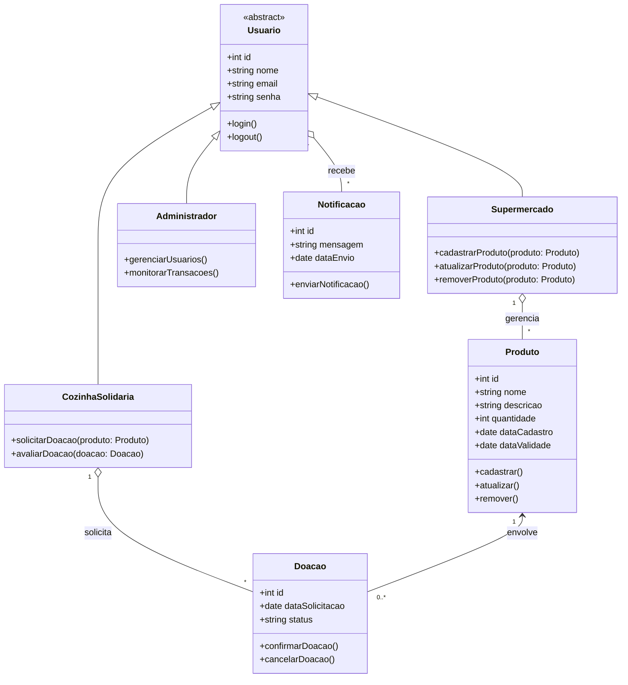

```mermaid
classDiagram
    %% Classe abstrata para usuários
    class Usuario {
        <<abstract>>
        +int id
        +string nome
        +string email
        +string senha
        +login()
        +logout()
    }
    
    %% Subclasses dos usuários
    class Supermercado {
        +cadastrarProduto(produto: Produto)
        +atualizarProduto(produto: Produto)
        +removerProduto(produto: Produto)
    }
    
    class CozinhaSolidaria {
        +solicitarDoacao(produto: Produto)
        +avaliarDoacao(doacao: Doacao)
    }
    
    class Administrador {
        +gerenciarUsuarios()
        +monitorarTransacoes()
    }
    
    %% Herança de Usuario
    Usuario <|-- Supermercado
    Usuario <|-- CozinhaSolidaria
    Usuario <|-- Administrador

    %% Classe Produto
    class Produto {
        +int id
        +string nome
        +string descricao
        +int quantidade
        +date dataCadastro
        +date dataValidade
        +cadastrar()
        +atualizar()
        +remover()
    }
    
    %% Classe Doacao
    class Doacao {
        +int id
        +date dataSolicitacao
        +string status
        +confirmarDoacao()
        +cancelarDoacao()
    }
    
    %% Classe Notificacao
    class Notificacao {
        +int id
        +string mensagem
        +date dataEnvio
        +enviarNotificacao()
    }
    
    %% Relacionamentos
    Supermercado "1" o-- "*" Produto : gerencia
    CozinhaSolidaria "1" o-- "*" Doacao : solicita
    Produto "1" <-- "0..*" Doacao : envolve
    Usuario "1" o-- "*" Notificacao : recebe
```

