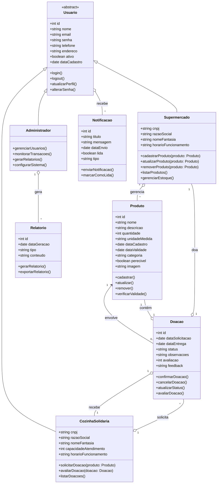

```mermaid
classDiagram
    %% Classe abstrata para usuários
    class Usuario {
        <<abstract>>
        +int id
        +string nome
        +string email
        +string senha
        +string telefone
        +string endereco
        +boolean ativo
        +date dataCadastro
        +login()
        +logout()
        +atualizarPerfil()
        +alterarSenha()
    }
    
    %% Subclasses dos usuários
    class Supermercado {
        +string cnpj
        +string razaoSocial
        +string nomeFantasia
        +string horarioFuncionamento
        +cadastrarProduto(produto: Produto)
        +atualizarProduto(produto: Produto)
        +removerProduto(produto: Produto)
        +listarProdutos()
        +gerenciarEstoque()
    }
    
    class CozinhaSolidaria {
        +string cnpj
        +string razaoSocial
        +string nomeFantasia
        +int capacidadeAtendimento
        +string horarioFuncionamento
        +solicitarDoacao(produto: Produto)
        +avaliarDoacao(doacao: Doacao)
        +listarDoacoes()
    }
    
    class Administrador {
        +gerenciarUsuarios()
        +monitorarTransacoes()
        +gerarRelatorios()
        +configurarSistema()
    }
    
    %% Herança de Usuario
    Usuario <|-- Supermercado
    Usuario <|-- CozinhaSolidaria
    Usuario <|-- Administrador

    %% Classe Produto
    class Produto {
        +int id
        +string nome
        +string descricao
        +int quantidade
        +string unidadeMedida
        +date dataCadastro
        +date dataValidade
        +string categoria
        +boolean perecivel
        +string imagem
        +cadastrar()
        +atualizar()
        +remover()
        +verificarValidade()
    }
    
    %% Classe Doacao
    class Doacao {
        +int id
        +date dataSolicitacao
        +date dataEntrega
        +string status
        +string observacoes
        +int avaliacao
        +string feedback
        +confirmarDoacao()
        +cancelarDoacao()
        +atualizarStatus()
        +avaliarDoacao()
    }
    
    %% Classe Notificacao
    class Notificacao {
        +int id
        +string titulo
        +string mensagem
        +date dataEnvio
        +boolean lida
        +string tipo
        +enviarNotificacao()
        +marcarComoLida()
    }
    
    %% Classe Relatorio
    class Relatorio {
        +int id
        +date dataGeracao
        +string tipo
        +string conteudo
        +gerarRelatorio()
        +exportarRelatorio()
    }
    
    %% Relacionamentos
    Supermercado "1" o-- "*" Produto : gerencia
    CozinhaSolidaria "1" o-- "*" Doacao : solicita
    Produto "1" <-- "0..*" Doacao : envolve
    Usuario "1" o-- "*" Notificacao : recebe
    Administrador "1" o-- "*" Relatorio : gera
    Doacao "1" o-- "1" Produto : contém
    Doacao "1" o-- "1" CozinhaSolidaria : recebe
    Doacao "1" o-- "1" Supermercado : doa
```

